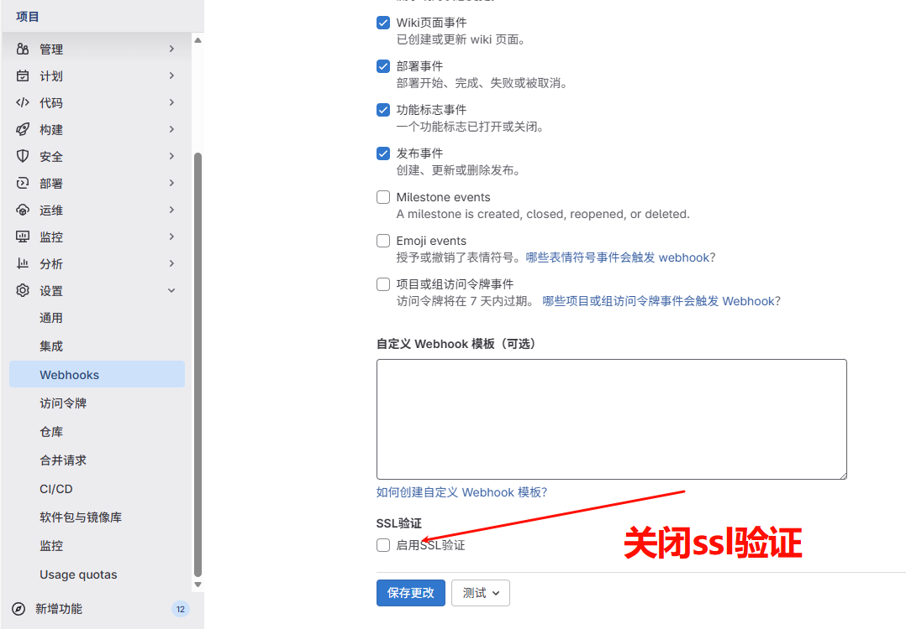
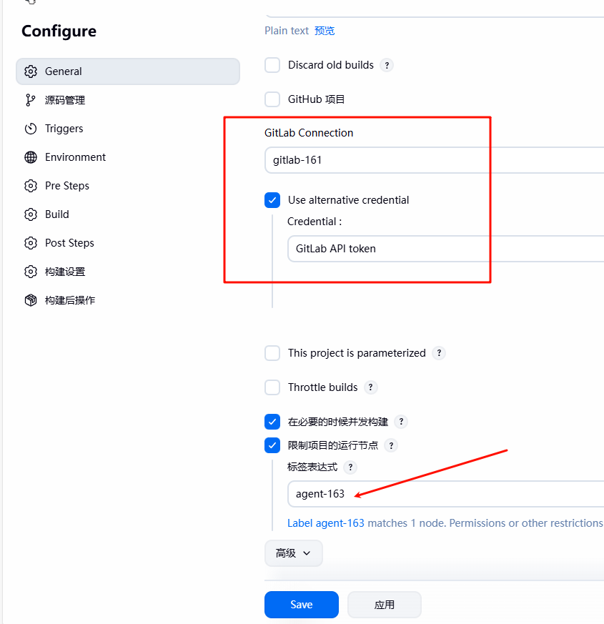
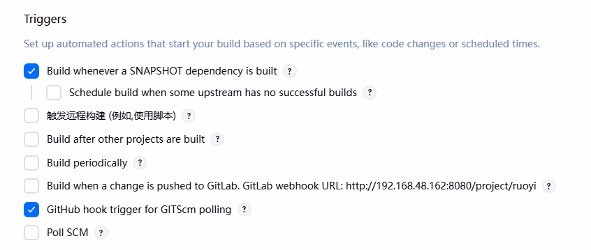
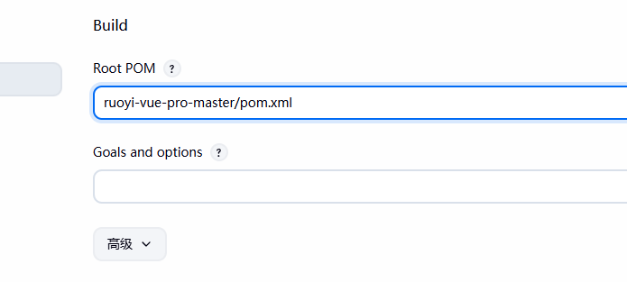
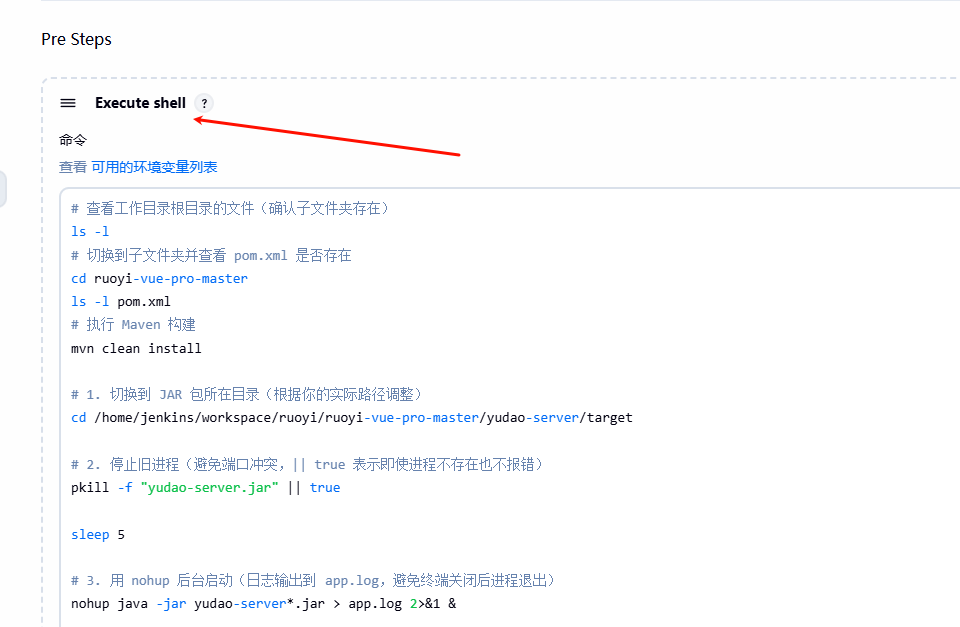
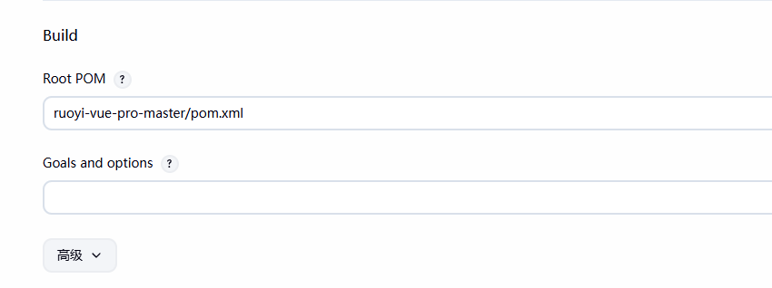
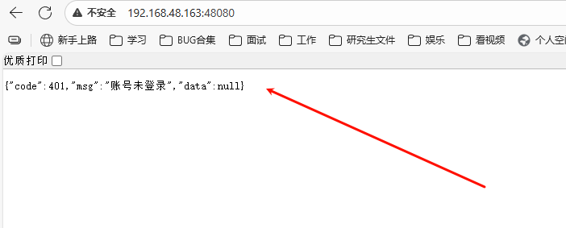
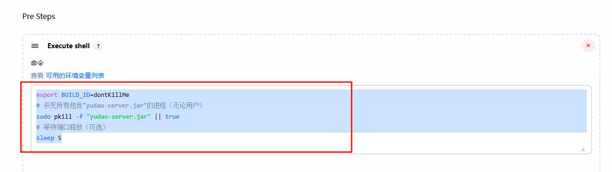
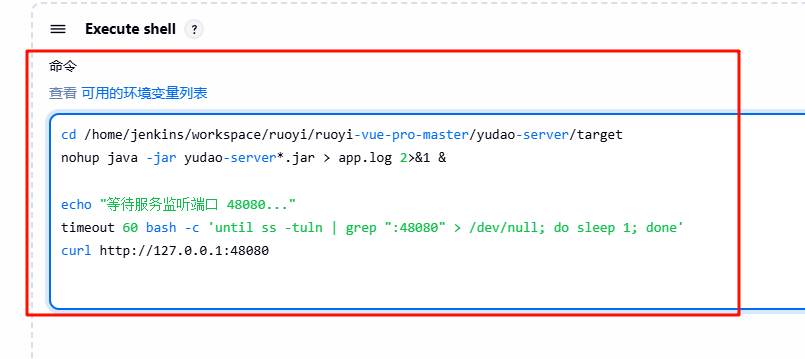
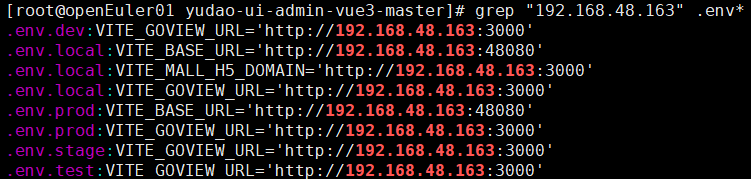

# 大致的原理

要理解**GitLab（161）+ Jenkins主节点（162）+ 代理节点（163）\**的Maven项目工作流程，首先需要明确\**各组件的核心角色**，再梳理**完整的流水线逻辑**（你的理解有偏差，关键错误是“不需要手动上传ZIP包”，而是通过Git版本控制自动同步代码）。

## **一、核心角色与前置条件**

先明确每个节点的职责：

- **GitLab（161）**：代码仓库，存储Maven项目的源代码，负责触发“代码变更”事件（如`git push`）。
- **Jenkins主节点（162）**：调度中心，负责接收GitLab的Webhook、管理构建任务、分配任务给代理节点、收集构建结果。
- **Jenkins代理节点（163）**：执行节点（Worker），负责**实际运行构建任务**（拉取代码、编译、打包、运行），需提前配置好Maven环境。

### **前置条件（必须完成）**

1. Jenkins代理节点（163）已连接主节：
   - 主节点（162）已添加代理节点（163）（`Manage Jenkins`→`Manage Nodes and Clouds`→`New Node`），并确保agent在线（通过SSH或JNLP连接）。
2. 代理节点（163）已配置Maven环境：
   - 方式1：在agent节点（163）手动安装Maven（如`/opt/maven`），并在Jenkins主节点的`Global Tool Configuration`中配置“Maven安装”（选择“手动指定路径”，填agent上的Maven路径）。
   - 方式2：在Jenkins主节点配置“自动安装Maven”（agent运行时自动下载Maven到本地，无需手动安装）。
3. GitLab与Jenkins已连通：
   - 主节点（162）已配置GitLab凭证（能拉取161的代码），GitLab的Webhook已指向主节点（162）的接收端点。

## **二、完整工作流程（Maven项目上线）**

以下是**从“代码开发”到“构建运行”的全流程**，按顺序执行：

### **步骤1：开发代码，推送到GitLab（161）**

开发者在本地编写Maven项目代码（如前所述的`maven-web-demo`），通过Git命令推送到GitLab仓库：

```BASH
# 初始化Git仓库（首次）
git init
git remote add origin http://192.168.48.161/root/maven-web-demo.git

# 提交代码并Push到GitLab
git add .
git commit -m "feat: 初始化Maven Web项目"
git push origin main
```

- GitLab会记录代码变更，并触发**Webhook事件**（向Jenkins主节点162发送HTTP请求）。

### **步骤2：Jenkins主节点（162）接收Webhook，分配任务给Agent（163）**

1. **主节点接收事件**：Jenkins主节点（162）收到GitLab的Webhook请求，确认“需要构建`maven-web-demo`项目”。
2. **分配任务到Agent**：主节点根据项目配置的**节点标签**（如给163节点打标签`maven-agent`），将构建任务分配给代理节点163（确保任务只在163上运行）。

### **步骤3：Agent节点（163）执行构建任务**

代理节点（163）收到主节点的任务后，按以下顺序执行：

1. **拉取GitLab代码**：
   Agent使用Jenkins配置的**Git凭证**（如GitLab的PAT令牌），从GitLab（161）拉取最新代码到Agent的**工作目录**（如`/var/jenkins/agent/workspace/maven-web-demo`）。

   - 无需手动上传ZIP包，Git会自动同步代码！

2. **执行Maven构建命令**：
   Agent使用**预配置的Maven环境**（如`maven-3.9.0`），执行项目的Maven命令（如`clean package`或`clean install`）。

   - 构建过程：编译Java代码→运行单元测试→打包成JAR/WAR包（输出到`target/`目录）。

3. **（可选）部署/运行应用**：
   若项目是Web应用（如Spring Boot），Agent可通过Shell命令运行JAR包（需确保端口不冲突）：

   ```BASH
   # 停止旧进程
   pkill -f "maven-web-demo-1.0-SNAPSHOT.jar" || true
   # 后台运行新包（日志输出到nohup.out）
   nohup java -jar target/maven-web-demo-1.0-SNAPSHOT.jar &
   ```

### **步骤4：主节点（162）收集结果，通知用户**

- Agent将构建日志、产物（如JAR包）同步回主节点；
- 主节点根据配置发送通知（如邮件、Slack），告知用户构建结果（成功/失败）；
- 若开启了“归档产物”，用户可从Jenkins主节点下载`target/`下的JAR包。

## **三、关键配置细节（确保流程通顺）**

### **1. Jenkins项目配置：指定Agent节点**

创建Maven项目时，需**限制构建到代理节点163**：

- 在项目配置的**General**（通用）部分，勾选**Restrict where this project can be run**（限制项目运行节点）；
- 填写**Label Expression**（节点标签）：如`maven-agent`（需给163节点打相同标签）。

### **2. Maven环境配置：Agent节点的Maven工具**

确保Agent能找到Maven：

- 方式1（手动安装）：在163节点安装Maven，路径如`/opt/maven`，然后在Jenkins主节点的`Global Tool Configuration`→`Maven`

  中添加：

  - Name: `maven-3.9.0`；
  - Installation directory: `/opt/maven`（Agent上的Maven路径）。

- 方式2（自动安装）：在Jenkins主节点的`Global Tool Configuration`→`Maven`

  中添加：

  - Name: `maven-3.9.0`；
  - 勾选**Install automatically**（自动安装），选择Maven版本（如`3.9.0`）；
  - Agent运行时会自动下载Maven到本地（无需手动安装）。

### **3. Git凭证配置：Agent拉取代码权限**

确保Agent能从GitLab拉取代码：

- 在Jenkins主节点的`Manage Jenkins`→`Manage Credentials`中添加**GitLab凭证**（如Username with password：用户名`root`，密码填GitLab的PAT令牌）；
- 在项目的**Source Code Management**（源码管理）部分，选择该凭证。

## **四、流程总结（一句话概括）**

```
开发者Git Push代码到GitLab（161）→ GitLab触发Webhook通知Jenkins主节点（162）→ 主节点分配任务给代理节点（163）→ Agent拉取GitLab代码→ 用Maven构建→ 运行应用→ 主节点收集结果并通知。
```

## **五、常见误区纠正**

1. **不需要手动上传ZIP包**：Git是版本控制工具，代码同步由Git自动完成，Agent会直接拉取GitLab的代码。
2. **Agent的工作目录是Git拉取的代码**：不是预先有包，而是每次构建都拉取最新代码。
3. **Maven环境配置在Agent上**：主节点只是调度，实际构建由Agent执行，所以Maven必须在Agent上可用。

按以上流程配置后，你就能实现**GitLab代码变更→Jenkins自动触发→Agent节点构建运行**的完整流水线！ 🚀

# gitlab中

现在webhook取消SSL验证，要不然在maven项目中跑不了



# Jenkins配置（主节点）

```
1.下载maven插件,主节上安装git
2.配置好agent节点的信息
3.配置好gitlab
```



然后配置好trigger



路径写相对的路径 主要是和你的gitlab相关的



# agent配置

```
1.下载mysql-server 配置密码为123456 记得启动
2.下载redis 记得启动 
3.下载yum install -y xdg-utils 前端要用的工具
4.下载 yum install -y libatomic 前端要用的工具
5.创建数据库`ruoyi-vue-pro`并且导入sql文件
6,下载npm
```


# 后端

后端基本没有变化（主要是在Jenkins上做好相关的配置）



根据pom.xml构建



```shell
# 可以先用作测试
# 后端
# 关键1：禁用Jenkins进程树杀手
export BUILD_ID=dontKillMe  

# 查看工作目录根目录的文件（确认子文件夹存在）
ls -l
# 切换到子文件夹并查看 pom.xml 是否存在
cd ruoyi-vue-pro-master
ls -l pom.xml
# 执行 Maven 构建
mvn clean install

# 1. 切换到 JAR 包所在目录（根据你的实际路径调整）
cd /home/jenkins/workspace/ruoyi/ruoyi-vue-pro-master/yudao-server/target

# 2. 停止旧进程（避免端口冲突，|| true 表示即使进程不存在也不报错）
sudo pkill -f "yudao-server.jar" || true

# 防止杀得太快了
sleep 30

# 3. 用 nohup 后台启动（日志输出到 app.log，避免终端关闭后进程退出）
nohup java -jar yudao-server*.jar > app.log 2>&1 &

# 4. 立即查看进程是否启动（确认输出中有 yudao-server 的进程）
ps -ef | grep yudao-server

# 5. 可选：打印日志前 10 行，验证启动
tail -n 10 app.log

# 6.测试
curl http://127.0.0.1:48080

# 输出这个{"code":401,"msg":"账号未登录","data":null} 说明后端没问题了

```




## 最终配置

```shell
# pre stpe
export BUILD_ID=dontKillMe
# 杀死所有包含"yudao-server.jar"的进程（无论用户）
sudo pkill -f "yudao-server.jar" || true
# 等待端口释放（可选）
sleep 5
```



```shell
# post step
cd /home/jenkins/workspace/ruoyi/ruoyi-vue-pro-master/yudao-server/target
nohup java -jar yudao-server*.jar > app.log 2>&1 &

echo "等待服务监听端口 48080..."
timeout 60 bash -c 'until ss -tuln | grep ":48080" > /dev/null; do sleep 1; done'
curl http://127.0.0.1:48080

```



# 前端

现在gitlab中修改.env文件把端口号改成8888，也是在shell脚本上配置好 然后访问8888的端口，因为其他用户不让用1024以下的端口

```shell
cd /home/jenkins/workspace/ruoyi/yudao-ui-admin-vue3-master

# 关键1：禁用 Jenkins 进程树杀手
export BUILD_ID=dontKillMe  

# 关键2：设置 npm 镜像（加速依赖安装）
npm config set registry https://registry.npmmirror.com

# 安装依赖
npm install -g pnpm
pnpm install

# 关键3：启动服务（端口已改为8888，无需sudo）
nohup npm run dev > nohup.out 2>&1 &  

# 关键4：等待端口监听（验证服务启动，端口改为8888）
echo "等待前端服务监听端口 8888..."
timeout 60 bash -c 'until ss -tuln | grep ":8888" > /dev/null; do sleep 1; done'

# 验证服务
curl http://127.0.0.1:8888

```

## 最终测试

```shell
# Pre Steps：构建前初始化
FRONTEND_PORT=8888  # 定义端口（与Post Steps一致）

# 1. 关闭旧前端进程（通过端口定位）
PID=$(ss -tuln | grep ":$FRONTEND_PORT" | awk '{print $7}' | cut -d',' -f2 | sed 's/pid=//')  
if [ -n "$PID" ]; then  
  kill -9 $PID || true  
  sleep 2  
fi  

# 2. 环境准备（复用你原有的命令）
export BUILD_ID=dontKillMe  
export LD_LIBRARY_PATH=/usr/lib64:$LD_LIBRARY_PATH  
npm config set registry https://registry.npmmirror.com

```


```shell
# Post Steps：构建后启动服务（关键：开头定义端口）
FRONTEND_PORT=8888  # 必须与Pre Steps一致！

# 1. 切换到前端目录
cd /home/jenkins/workspace/ruoyi/yudao-ui-admin-vue3-master  

# 2. 安装依赖
npm install  

# 3. 启动服务（确保项目端口是8888）
nohup npm run dev > nohup.out 2>&1 &  

# 4. 等待端口监听（会显示8888）
echo "等待前端服务监听端口 $FRONTEND_PORT..."  
timeout 60 bash -c 'until ss -tuln | grep ":$FRONTEND_PORT" > /dev/null; do sleep 1; done'  

# 5. 验证服务（端口正确）
curl http://127.0.0.1:$FRONTEND_PORT

```


# 前后端合并

内存会出问题 注意了要

```
nohup java -Xmx512m -jar yudao-server*.jar > app.log 2>&1 &  
```

## 前后端对接

```shell
# 去你上传gitlab文件夹的那个服务器中
# 打个比方
cd /root/test/yudao-ui-admin-vue3-master
# 然后把所有的回环地址127.0.0.1改成192.168.48.163地址 也就是你的代理服务器的节点
vim .env
vim .env.local之类的

[root@openEuler01 yudao-ui-admin-vue3-master]# grep "192.168.48.163" .env*
.env.dev:VITE_GOVIEW_URL='http://192.168.48.163:3000'
.env.local:VITE_BASE_URL='http://192.168.48.163:48080'
.env.local:VITE_MALL_H5_DOMAIN='http://192.168.48.163:3000'
.env.local:VITE_GOVIEW_URL='http://192.168.48.163:3000'
.env.prod:VITE_BASE_URL='http://192.168.48.163:48080'
.env.prod:VITE_GOVIEW_URL='http://192.168.48.163:3000'
.env.stage:VITE_GOVIEW_URL='http://192.168.48.163:3000'
.env.test:VITE_GOVIEW_URL='http://192.168.48.163:3000'

# 然后接着
git add .
git -m commit "change the address from 127.0.0.1 to agent"
git push origin ruoyi
```




以下是**递归替换所有`.env*`文件中`127.0.0.1`为`192.168.48.163`**的命令（结合`grep`找文件、`sed`做替换）：

### **完整命令**

```BASH
grep -rl '127\.0\.0\.1' .env* | xargs sed -i 's/127\.0\.0\.1/192.168.48.163/g'
grep -rl 'localhost' .env* | xargs sed -i 's/localhost/192.168.48.163/g'
grep 192.168.48.163 .env*
```

### **命令解释**

1. **`grep -rl '127\.0\.0\.1' .env\*`**：
   - `grep`：查找文件内容；
   - `-r`：递归查找（处理当前目录及子目录下的`.env*`文件）；
   - `-l`：仅输出**包含目标字符串的文件名**（不显示匹配内容）；
   - `'127\.0\.0\.1'`：要查找的目标字符串（`.`,点号在正则中是「任意字符」，需用`\`转义）；
   - `.env*`：匹配所有以`.env`开头的文件（如`.env.development`、`.env.production`）。
2. **`xargs sed -i 's/127\.0\.0\.1/192.168.48.163/g'`**：
   - `xargs`：将`grep`输出的文件名传递给`sed`；
   - `sed`：流编辑器（用于文本替换）；
   - `-i`：**原地修改文件**（直接修改原文件，无需备份）；
   - `s/old/new/g`：替换规则（`s`=替换，`g`=全局替换，即一行内所有匹配都替换）；
   - `'127\.0\.0\.1'`：要替换的旧字符串（需转义点号）；
   - `'192.168.48.163'`：替换后的新字符串（无需转义，直接写IP）。

### **验证替换效果**

替换后，可通过以下命令检查是否替换成功：

```BASH
grep -r '192.168.48.163' .env*
```

若输出包含`.env*`文件及替换后的IP，说明替换成功。

### **注意事项**

- **转义点号**：`127.0.0.1`中的`.`在正则中是「任意字符」，必须用`\`转义为`127\.0\.0\.1`，否则会错误匹配类似`127a0b0c1`的字符串；
- **系统差异**：若在MacOS上执行，`sed -i`需加空参数（`sed -i '' 's/...'`），Linux无需；
- **备份建议**：若担心误操作，可先给`sed`加备份参数（如`-i.bak`），保留原文件备份（`sed -i.bak 's/...'`）。

此命令将**一次性处理所有`.env\*`文件**，彻底解决前端配置中的`127.0.0.1`问题！ 😊

## Jenkins脚本

```shell
# Pre Steps：构建前初始化
# 1. 杀死后端旧进程（sudo确保杀死所有用户的进程）
sudo pkill -f "yudao-server.jar" || true
sleep 5
# 验证后端旧进程是否残留
echo "后端旧进程残留：$(ps -ef | grep yudao-server.jar | grep -v grep || echo "无")"

# 2. 杀死前端旧进程（端口定位）
FRONTEND_PORT=8888
PID=$(ss -tuln | grep ":$FRONTEND_PORT" | awk '{print $7}' | cut -d',' -f2 | sed 's/pid=//')  
if [ -n "$PID" ]; then  
  kill -9 $PID || true  
  sleep 2  
fi  
echo "前端旧进程残留：$(ps -ef | grep "npm run dev" | grep -v grep || echo "无")"

# 3. 环境准备
export BUILD_ID=dontKillMe  
export LD_LIBRARY_PATH=/usr/lib64:$LD_LIBRARY_PATH  
npm config set registry https://registry.npmmirror.com

```


```shell
# Post Steps：构建后启动服务（关键：添加BUILD_ID）
# ------------------------------
# 1. 启动后端（必须先设置BUILD_ID！）
# ------------------------------
cd /home/jenkins/workspace/ruoyi/ruoyi-vue-pro-master/yudao-server/target

# 关键：设置BUILD_ID，让Jenkins不清理后端进程！
export BUILD_ID=dontKillMe  

echo "启动后端服务..."
nohup java -Xmx512m -jar yudao-server*.jar > app.log 2>&1 &  
BACKEND_PID=$!  
echo "后端进程PID：$BACKEND_PID"

# 等待后端端口监听
echo "等待后端监听端口 48080..."
if timeout 60 bash -c 'until ss -tuln | grep ":48080" > /dev/null; do sleep 1; done'; then
  echo "后端端口 48080 已监听"
else
  echo "ERROR：后端启动超时！日志最后10行："
  tail -n 10 app.log
  exit 1
fi

# 验证后端服务
CURL_RESULT=$(curl -s http://127.0.0.1:48080)
if echo "$CURL_RESULT" | grep "\"code\":401"; then
  echo "后端服务正常"
else
  echo "ERROR：后端服务异常！响应：$CURL_RESULT"
  tail -n 10 app.log
  exit 1
fi

# ------------------------------
# 2. 启动前端（同样需要设置BUILD_ID！）
# ------------------------------
FRONTEND_PORT=8888
cd /home/jenkins/workspace/ruoyi/yudao-ui-admin-vue3-master  

# 关键：前端也需要设置BUILD_ID，避免被Jenkins杀死！
export BUILD_ID=dontKillMe  

# 安装依赖
npm install  

# 启动前端
echo "启动前端服务..."
nohup npm run dev > nohup.out 2>&1 &  
FRONTEND_PID=$!
echo "前端进程PID：$FRONTEND_PID"

# 等待前端端口监听
echo "等待前端监听端口 $FRONTEND_PORT..."
if timeout 60 bash -c 'until ss -tuln | grep ":$FRONTEND_PORT" > /dev/null; do sleep 1; done'; then
  echo "前端端口 $FRONTEND_PORT 已监听"
else
  echo "ERROR：前端启动超时！日志最后10行："
  tail -n 10 nohup.out
  exit 1
fi

# 验证前端服务
curl -s http://127.0.0.1:$FRONTEND_PORT | grep "<html" && echo "前端服务正常" || (echo "前端服务异常" && exit 1)

# ------------------------------
# 3. 最终验证
# ------------------------------
echo "前后端构建成功！"
echo "后端端口：48080（正常）"
echo "前端端口：$FRONTEND_PORT（正常）"


curl -s http://127.0.0.1:8888
curl -s http://127.0.0.1:48080

```


# BUG

## 1.不要自己在agent上手动构建

从错误日志看，核心问题是 **Jenkins 用户没有权限删除/修改 `yudao-ui-admin-vben` 目录下的文件**（因为文件所有者是 `root` 或其他用户，而 Jenkins 用 `jenkins` 用户运行）。

### **一、错误原因**

你之前可能用 **`root` 用户手动操作过 `yudao-ui-admin-vben` 目录**（比如克隆、修改文件），导致目录的**所有者是 `root`**。而 Jenkins 默认用 **`jenkins` 用户**执行构建命令，没有权限删除/修改 `root` 所有的文件，因此报 `Permission denied`。

### **二、解决步骤**

#### **1. 确认 Jenkins 运行用户**

首先确认 Jenkins 的运行用户（默认是 `jenkins`）：

```
# 查看 Jenkins 进程的用户
ps aux | grep jenkins
```

输出中类似 `jenkins 1234 ...`，说明运行用户是 `jenkins`。

#### **2. 递归修改目录所有者为 Jenkins 用户**

将 Jenkins 工作空间的**所有文件/目录的所有者**改为 `jenkins`（确保 Jenkins 有完全控制权）：

```
# 替换为你的 Jenkins 工作空间路径（从错误日志看是 /home/jenkins/workspace/...）
chown -R jenkins:jenkins /home/jenkins/workspace/ruoyi/ruoyi-vue-pro-master/yudao-ui/yudao-ui-admin-vben
```

#### **3. （可选）彻底清理旧目录（若仍报错）**

如果修改权限后仍无法删除，可手动用 `root` 用户清理旧目录，再让 Jenkins 重新克隆：

```
# 用 root 用户删除旧目录（确保清理干净）
rm -rf /home/jenkins/workspace/ruoyi/ruoyi-vue-pro-master/yudao-ui/yudao-ui-admin-vben

# 重新让 Jenkins 构建（此时 Jenkins 会用自己的用户克隆/创建目录，不会再有权限问题）
```

#### **4. （可选）关闭 SELinux（若权限仍有问题）**

如果服务器开启了 **SELINUX**（默认 CentOS/RHEL 开启），可能会干扰 Jenkins 的文件操作。可临时关闭验证：

```
# 临时关闭 SELINUX（重启后失效）
setenforce 0
```

若关闭后问题解决，可**永久关闭 SELINUX**（修改 `/etc/selinux/config`，将 `SELINUX=enforcing` 改为 `SELINUX=disabled`，需重启服务器）。

### **三、Jenkins 构建命令优化（避免后续权限问题）**

为了彻底避免权限问题，建议 **Jenkins 构建命令中不要用 `root` 用户操作**，所有克隆/修改操作都用 `jenkins` 用户执行（Jenkins 默认会用自己的用户）。

### **四、验证修复**

修改权限后，重新运行 Jenkins 构建：

1. 构建日志中**不会再出现 `Permission denied`**；
2. `yudao-ui-admin-vben` 目录的所有者会是 `jenkins`（用 `ls -l` 验证）。

### **总结**

权限问题的核心是 **文件所有者与 Jenkins 运行用户不一致**，通过 `chown` 递归修改所有者即可解决。后续操作中，**避免用 `root` 用户手动修改 Jenkins 工作空间的文件**，否则会再次出现权限问题！ 🚀


## 2.手动执行前端脚本报错

从报错信息 `node: error while loading shared libraries: libatomic.so.1: cannot open shared object file: No such file or directory` 可以看出，**核心问题是 Jenkins 执行环境中缺少 `libatomic.so.1` 共享库**，导致 Node.js 无法正常运行。

### 一、为什么手动执行没问题，Jenkins 执行报错？

手动执行和 Jenkins 执行的**环境变量（尤其是 `LD_LIBRARY_PATH`）或用户权限不同**：

- 手动执行时（比如用 `root` 用户），系统的 `LD_LIBRARY_PATH` 可能默认包含了 `libatomic.so.1` 的路径（如 `/usr/lib64`），或者你之前安装过相关包；
- Jenkins 通常以 `jenkins` 用户运行，其环境变量可能**未包含 `libatomic.so.1` 的路径**，或系统未安装该库。

### 二、解决步骤

#### **1. 第一步：确认 `libatomic.so.1` 的位置和归属（在 Agent 节点执行）**

先在 Agent 节点（即运行 Jenkins 任务的机器）上检查 `libatomic.so.1` 是否存在，以及属于哪个包：

```
# 查找 libatomic.so.1 的位置（常见路径是 /usr/lib64）
find / -name libatomic.so.1 2>/dev/null

# 查看该文件属于哪个包（以 OpenEuler/CentOS 为例）
rpm -qf /usr/lib64/libatomic.so.1
```

- **如果输出为空**：说明系统未安装 `libatomic` 包，需安装；
- **如果输出包名**（如 `libatomic-7.3.0-20210202.el7.x86_64`）：说明已安装，但 Jenkins 环境变量未包含该路径。

#### **2. 第二步：安装 `libatomic` 包（若缺失）**

`libatomic.so.1` 属于 `libatomic` 包（或 `glibc` 的一部分，部分系统默认不安装）。在 Agent 节点执行：

```
# OpenEuler/CentOS/RHEL 系统（yum 包管理器）
sudo yum install -y libatomic
```

#### **3. 第三步：在 Jenkins 脚本中设置 `LD_LIBRARY_PATH`**

即使安装了 `libatomic`，Jenkins 的环境变量可能仍未包含 `libatomic.so.1` 的路径（如 `/usr/lib64`）。需在脚本**开头**添加环境变量配置：

```
# 前端
cd /home/jenkins/workspace/ruoyi/yudao-ui-admin-vue3-master

# 关键：设置 LD_LIBRARY_PATH，确保 Node.js 能找到 libatomic.so.1
export LD_LIBRARY_PATH=/usr/lib64:$LD_LIBRARY_PATH  # 替换为你实际的 libatomic.so.1 路径

# 安装 pnpm，提升依赖的安装速度
npm config set registry https://registry.npmmirror.com
npm install -g pnpm
# 安装依赖
pnpm install

# 启动服务
npm run dev
```

### 三、验证解决效果

修改脚本后，重新运行 Jenkins 任务：

- 若不再报 `libatomic.so.1` 错误，说明环境变量配置成功；
- 若仍报错，检查 `libatomic.so.1` 的路径是否正确（比如 `find` 命令的输出），并调整 `LD_LIBRARY_PATH` 的值。

### 四、补充：为什么 `npm run dev` 在手动执行时没问题？

`npm run dev` 最终调用的是 Node.js，而 Node.js 依赖 `libatomic.so.1`（尤其是处理原子操作时）。手动执行时，`LD_LIBRARY_PATH` 包含该库的路径，所以 Node.js 能正常加载；Jenkins 环境中缺少该路径，导致加载失败。

### 总结

核心解决点是**安装缺失的 `libatomic` 包** + **在 Jenkins 脚本中设置正确的 `LD_LIBRARY_PATH`**，确保 Node.js 能找到依赖的共享库。按上述步骤操作后，Jenkins 任务应能正常执行！ 🚀


## 3. 前端锁文件问题

方案 1（更新锁文件）的操作**主要在「本地开发环境」完成**，最终通过 Git 仓库（如 GitLab）同步到 Jenkins 的 Agent 节点。以下是**完整流程的节点分工**和**关键逻辑**：

### **一、各节点的作用与操作步骤**

#### **1. 第一步：本地开发环境（你的电脑）——生成并更新锁文件**

**核心操作**：在本地项目根目录执行 `pnpm install`，根据 `package.json` 生成**最新的 `pnpm-lock.yaml`**。
**为什么必须在本地？**：

- 你需要修改 `package.json`（比如新增依赖），而锁文件的生成依赖于本地的 `package.json`；
- 本地环境是你开发和测试的地方，生成的锁文件会包含**你实际使用的依赖版本**（确保与本地运行环境一致）。

**操作命令**：

```BASH
cd yudao-ui-admin-vue3-master  # 进入前端项目目录
pnpm install  # 根据 package.json 生成新的 pnpm-lock.yaml
```

#### **2. 第二步：Git 仓库（如 GitLab/GitHub）——存储并同步锁文件**

**核心操作**：将本地更新后的 `pnpm-lock.yaml` 提交到 Git 仓库的 `ruoyi` 分支。
**为什么需要 Git 仓库？**：

- Git 仓库是**代码和锁文件的“唯一数据源”**，Jenkins 的 Agent 节点会从这里拉取代码和锁文件；
- 只有将锁文件提交到 Git，才能保证所有环境（包括 Jenkins）拉取的锁文件是**最新且一致的**。

**操作命令**：

```BASH
git add pnpm-lock.yaml  # 暂存锁文件
git commit -m "chore: update pnpm-lock.yaml"  # 提交锁文件
git push origin ruoyi  # 推送到 Git 仓库的 ruoyi 分支
```

#### **3. 第三步：Jenkins Agent 节点——拉取并使用锁文件**

**核心操作**：Jenkins 从 Git 仓库拉取 `ruoyi` 分支的代码（包括最新的 `pnpm-lock.yaml`），然后执行 `pnpm install`。
**为什么 Agent 节点不需要生成锁文件？**：

- Agent 是**构建执行环境**，其核心职责是“按锁文件安装依赖”，而不是“生成锁文件”；
- 如果在 Agent 节点生成锁文件，会导致锁文件与本地开发环境不一致（比如依赖版本不同），破坏构建的可重复性。

### **二、总结：各节点的分工逻辑**

|      节点类型      |               核心职责                |                   关键操作                    |
| :----------------: | :-----------------------------------: | :-------------------------------------------: |
|    本地开发环境    | 修改 `package.json` + 生成最新锁文件  |       `pnpm install` + 提交锁文件到 Git       |
|      Git 仓库      |        存储并同步代码和锁文件         |             接收本地提交的锁文件              |
| Jenkins Agent 节点 | 拉取最新代码+锁文件，按锁文件安装依赖 | `git pull` + `pnpm install`（默认冻结锁文件） |

### **三、关键结论**

方案 1 的**核心逻辑**是：
**锁文件的生成和更新必须在「本地开发环境」完成**（确保与你实际使用的依赖一致），再通过 Git 仓库同步到所有环境（包括 Jenkins Agent），最终保证**所有环境的依赖版本 100% 一致**。

如果跳过“本地更新锁文件”的步骤，直接在 Agent 节点生成锁文件，会导致：

- Agent 生成的锁文件与你本地的依赖版本不一致（比如自动升级了某个依赖）；
- 出现“本地能跑、CI 跑不通”的问题，破坏构建的可重复性。

### **举个通俗的例子**

- 本地环境是“你家厨房”：你按菜谱（`package.json`）买了食材（依赖），并写了一张“采购清单”（`pnpm-lock.yaml`）；
- Git 仓库是“冰箱”：你把清单和食材放进冰箱（提交锁文件）；
- Agent 节点是“餐厅厨房”：厨师从冰箱拿清单和食材（拉取锁文件和代码），严格按清单做饭（按锁文件安装依赖）。

如果“餐厅厨房”自己写清单（在 Agent 生成锁文件），可能买错食材（依赖版本），做出来的菜和你家的味道不一样（构建结果不一致）。

这样就能理解为什么方案 1 必须在**本地开发环境**更新锁文件，再通过 Git 仓库同步到 Agent 节点了吧！ 🚀


## 4.端口问题

从最新日志看，**核心错误是「非 root 用户无法绑定 80 端口」**，导致 Vite 开发服务器启动失败。以下是**问题定位+终极解决指南**：

### **一、错误原因**

Unix/Linux 系统中，**端口号 ≤ 1024**（如 80、443）属于「特权端口」，只有 `root` 用户才能绑定。而 Jenkins 通常以 `jenkins` 非特权用户运行，因此 `vite` 无法启动在 `0.0.0.0:80`。

### **二、解决方法（两种方案，推荐第一种）**

#### **方案 1：修改 Vite 端口为非特权端口（推荐，彻底解决）**

将 Vite 的开发服务器端口从 **80** 改为 **≥1024 的端口**（如 8080、3000 等），这样非 root 用户也能绑定。

**步骤**：

1. **找到 Vite 端口配置**：
   检查项目中的 `vite.config.js` 或 `.env.local`（或 `.env.development`）文件，找到端口设置：

   - 若用`vite.config.js`：

     ```JAVASCRIPT
     // vite.config.js
     export default {
       server: {
         port: 80, // 改为 8080 或其他非特权端口
         host: '0.0.0.0'
       }
     }
     ```

   - 若用`.env.local`：

     ```ENV
     # .env.local
     VITE_PORT=80 # 改为 8080
     
     # 或者添加一行
     # 新增：设置 Vite 开发服务器端口（非特权端口，如 8080）
     VITE_PORT=8080
     ```

2. **修改端口并重新提交**：
   将端口改为 `8080` 后，重新提交代码到 Git 仓库（包括 `vite.config.js` 或 `.env.local`）。

3. **重新运行 Jenkins 构建**：
   此时 Vite 会启动在 `0.0.0.0:8080`，`jenkins` 用户有权限绑定，服务能正常启动。

#### **方案 2：给 Node 进程赋予绑定特权端口的权限（不推荐，有安全风险）**

如果必须用 80 端口，可以通过 `setcap` 命令给 Node 进程赋予「绑定特权端口」的能力：

```BASH
# 在 Jenkins Agent 节点执行（需要 root 权限）
sudo setcap CAP_NET_BIND_SERVICE=+eip $(which node)
```

**风险**：这会让所有 Node 进程都能绑定特权端口，可能引入安全隐患（如恶意 Node 程序占用 80 端口）。

### **三、额外建议：避免在 CI 中运行 `npm run dev`**

`npm run dev` 是**开发环境命令**（用于本地热更新），在 Jenkins 中运行会：

1. **阻塞构建进程**：`dev` 模式会前台运行，导致 Jenkins 构建一直处于「运行中」（不会自动结束）；
2. **服务无法持久化**：Jenkins 断开后，`dev` 服务器会停止（进程是 Jenkins 子进程）。

**推荐生产环境流程**：

```BASH
# 1. 构建生产包（生成 dist 目录）
npm run build

# 2. 用 Nginx/Apache 部署 dist 目录（稳定、高性能）
# 示例：Nginx 配置（/etc/nginx/conf.d/yudao-ui.conf）
server {
    listen 80;
    server_name your_domain.com;
    root /home/jenkins/workspace/ruoyi/yudao-ui-admin-vue3-master/dist;
    index index.html;

    location / {
        try_files $uri $uri/ /index.html; # 解决单页应用路由问题
    }
}
```

### **总结**

当前问题的**终极解决方案**是：

1. 修改 Vite 端口为非特权端口（如 8080）；
2. 提交配置文件到 Git；
3. 重新运行 Jenkins 构建。

按此操作后，Vite 开发服务器能正常启动，构建会成功！ 🚀

如果需要进一步调整端口或部署生产环境，随时告诉我！


## 5. npm前端运行可以，但是后端运行不行


从日志和操作来看，**核心问题是 Jenkins 的「进程树杀手（ProcessTreeKiller）」杀死了后台启动的 Vite 进程**——Jenkins 构建完成后，会默认杀死构建过程中启动的所有子进程（包括 `nohup` 启动的后台进程），导致 Vite 进程「假启动」（日志显示成功，但实际已被杀死）。

### **1. 问题根源：Jenkins 的 ProcessTreeKiller**

Jenkins 有一个默认开启的「进程树杀手」功能，目的是防止构建后残留无用进程。但它会**误杀你需要长期运行的 Vite 服务**：

- 你用 `nohup npm run dev &` 启动 Vite 后，Jenkins 构建完成，会立即杀死这个 Vite 进程；
- 你登录 Agent 节点时，Vite 已经被杀死，因此 `ps` 查不到进程，`ss` 看不到端口监听。

### **2. 解决方法：让 Vite 进程脱离 Jenkins 控制**

只需在 Jenkins 脚本中添加**两行命令**，即可让 Vite 进程「逃过」ProcessTreeKiller 的追杀：

#### **修正后的 Jenkins 脚本（关键新增两行）**

```BASH
# 前端
cd /home/jenkins/workspace/ruoyi/yudao-ui-admin-vue3-master

# 关键1：禁用 Jenkins 进程树杀手（防止杀死后台进程）
export BUILD_ID=dontKillMe  

# 关键2：设置 LD_LIBRARY_PATH（确保 Node 能找到 libatomic.so.1）
export LD_LIBRARY_PATH=/usr/lib64:$LD_LIBRARY_PATH  

# 安装 pnpm
npm config set registry https://registry.npmmirror.com
npm install -g pnpm
pnpm install

# 启动服务（用 setsid 脱离 Jenkins 进程树，双重保险）
nohup setsid npm run dev > nohup.out 2>&1 &  

# 验证服务状态（可选，确认进程存活）
sleep 5
if ps aux | grep 'vite' | grep -v 'grep' > /dev/null; then
  echo "Vite 服务已稳定运行（未被 Jenkins 杀死）！"
  ss -tuln | grep 8888  # 显示端口监听状态
else
  echo "Vite 服务启动失败，请检查日志！"
  tail -n 50 nohup.out
  exit 1
fi
```

### **3. 关键命令解释**

- **`export BUILD_ID=dontKillMe`**：告诉 Jenkins 不要杀死当前构建的进程树，是最直接的解决方案；
- **`setsid`**：让 Vite 进程「脱离」当前 shell 的进程组，即使 Jenkins 尝试杀进程，也找不到 Vite 的「归属」，是双重保险。

### **3. 验证效果**

修改脚本后重新运行 Jenkins 构建：

1. 构建完成后，登录 Agent 节点（`192.168.48.163`）；
2. 执行 `ps aux | grep node`，**能看到 Vite 进程**（如 `node /path/to/vite`）；
3. 执行 `ss -tuln | grep 8080`，**能看到 8080 端口监听**（`0.0.0.0:8080`）；
4. 浏览器访问 `http://192.168.48.163:8080`，**页面正常加载**。

### **4. 补充说明：为什么之前直接运行 `npm run dev` 能访问？**

直接运行 `npm run dev` 时，进程在**前台**，Jenkins 构建会「卡住」（无法完成），因此 ProcessTreeKiller 不会启动；而用 `nohup` 后台启动时，Jenkins 构建会「成功完成」，触发 ProcessTreeKiller 杀死进程。

### **总结**

- 你的 Vite 服务本身配置正确（`nohup.out` 显示成功启动）；
- 问题出在 Jenkins 的「进程树杀手」误杀了后台进程；
- 添加 `export BUILD_ID=dontKillMe` 和 `setsid` 后，进程会长期存活，页面可正常访问。

按此修改后，问题会彻底解决！ 😊


## 6.权限问题 给Jenkins好一点的权限吧

从你的输出可知，**核心问题已明确**：`jenkins`用户**没有sudo权限**，无法杀死`root`用户启动的旧进程（如PID 17704），导致48080端口始终被占用，新进程无法监听。

### **一、解决问题的「唯一前提」**

必须**给`jenkins`用户添加sudo权限**（否则无法杀死root进程），这是解决所有问题的基础！

### **二、操作步骤（需`root`用户执行）**

#### **1. 步骤1：用`root`用户登录服务器**

你需要先切换到`root`用户（或用其他有sudo权限的用户），才能修改`sudoers`文件。

#### **2. 步骤2：给`jenkins`用户添加「无密码sudo权限」**

**关键**：必须用`visudo`命令编辑`sudoers`文件（避免语法错误导致系统崩溃）！

```BASH
# 1. 用visudo编辑sudoers文件（root用户执行）
visudo

# 2. 在文件末尾添加以下内容（复制粘贴）：
jenkins ALL=(ALL) NOPASSWD: ALL

# 3. 保存退出（visudo的保存方式：按Esc→输入:wq→回车）
```

#### **3. 步骤3：验证`jenkins`用户的sudo权限**

切换到`jenkins`用户，验证是否能无密码执行sudo：

```BASH
# 1. 切换到jenkins用户
su - jenkins

# 2. 执行sudo命令（如查看root的进程）
sudo ps -ef | grep root

# 3. 若无需输入密码且能正常输出，说明权限添加成功！H
```

### **三、修改后的Jenkins脚本（需sudo杀进程）**

给`jenkins`用户添加sudo权限后，修改Jenkins脚本中的「停止旧进程」步骤，**用sudo杀死root进程**：

```BASH
# Jenkins后端脚本（关键部分）
# 1. 停止旧进程（sudo杀死root进程，确保端口释放）
PORT=48080  
# 查找占用端口的进程PID（无论用户）
PID=$(ss -tuln | grep ":$PORT" | awk '{print $7}' | cut -d',' -f2 | sed 's/pid=//')  
if [ -n "$PID" ]; then  
  echo "用sudo杀死进程 $PID（root用户）"  
  sudo kill -9 $PID || true  # 用sudo强制杀死root进程  
  sleep 5  # 等待端口释放  
fi  

# 2. 验证端口是否释放（必须无输出）
ss -tuln | grep ":$PORT"  

# 3. 启动新进程（jenkins用户）
nohup java -jar yudao-server*.jar > app.log 2>&1 &  
```

### **四、验证成功的标志**

1. `sudo kill -9 $PID`不再报错（能杀死root进程）；
2. `ss -tuln | grep ":48080"`显示**无输出**（端口释放）；
3. 新进程启动后，`ss -tuln | grep ":48080"`显示**jenkins用户的进程监听该端口**；
4. `curl http://127.0.0.1:48080`返回`{"code":401,...}`（服务正常）。

### **五、为什么必须这么做？**

- 旧进程是`root`启动的，只有`root`或有sudo权限的用户才能杀死它；
- 若不杀死旧进程，48080端口始终被占用，新进程无法监听该端口，导致启动失败。

### **总结**

解决问题的**顺序不能变**：

1. 给`jenkins`用户加sudo权限→2. 用sudo杀死root旧进程→3. 启动新进程。

## 7.内存不足问题 JVM环境

nohup java -Xmx512m -jar yudao-server*.jar > app.log 2>&1 &
这样的就可以了

刚刚这样nohup java -jar yudao-server*.jar > app.log 2>&1 & 试了一下都起不来端口

```
	用户现在的问题是用默认的java -jar启动后端没端口，加了-Xmx512m就好了，需要解释原因和优化建议。
首先，得明确是内存不足导致的启动失败，默认JVM内存参数太小，后端依赖多的话不够用。然后，要说明为什么加内存参数有用，再给一些优化建议，比如调整内存参数、配置JVM参数的最佳实践，还有日志里看内存的方法。
	首先，回顾用户的情况：之前不加-Xmx512m启动不了，加了就能起来，说明是JVM堆内存不足导致后端启动时初始化失败（比如加载大量类、初始化Spring容器时内存不够，进程直接崩溃，端口没起来）。
接下来，要解释JVM的默认内存设置：Java8及以上默认的堆内存最大值（-Xmx）是物理内存的1/4或1GB（取较小值），如果机器内存小（比如2GB），默认-Xmx可能只有512MB甚至更小，但后端项目依赖多（比如Spring Boot、数据库驱动、Redis客户端、各种工具类），加载这些类和初始化容器需要更多内存，导致内存溢出，进程崩溃。
	然后，要给出优化建议：比如根据机器内存调整-Xmx和-Xms（初始堆内存），比如机器有4GB内存，可以设-Xms256m -Xmx1024m，这样初始内存小，逐渐扩展到1GB，避免内存浪费。还要建议把JVM参数写到启动脚本里，避免每次手动加。
	另外，建议在后端日志里加GC日志，方便后续排查内存问题，比如-XX:+PrintGCDetails -XX:+PrintGCDateStamps -Xloggc:gc.log，这样可以看到内存使用情况。还要提醒用户检查机器内存：用free -h看机器内存，确保有足够的内存分配给JVM。比如机器内存是2GB，给JVM分配1GB（-Xmx1024m）就比较合理，剩下的给系统和其他进程。
	另外，要确认用户的后端项目是不是依赖很多，比如有没有用很多第三方库，或者初始化时加载了大量数据（比如缓存预热），这些都会增加内存消耗。如果有，可以进一步优化，比如减少不必要的依赖，或者调整缓存策略。
	最后，总结一下：加-Xmx512m解决了内存不足的问题，让后端能正常初始化和监听端口，后续可以根据机器内存调整更合适的JVM参数，确保稳定运行。
```

从你的反馈能**100%定位根因**：
**后端启动时「JVM堆内存不足」**，导致初始化过程（加载类、启动Spring容器、连接数据库等）失败，进程直接崩溃（端口来不及监听就退出了）。

### **一、为什么`-Xmx512m`能解决问题？**

Java的JVM堆内存（Heap）默认设置非常「保守」：

- Java 8及以上版本，默认**最大堆内存（`-Xmx`）**为「物理内存的1/4」或「1GB」（取较小值）；
- 若你的机器内存较小（比如2GB），默认`-Xmx`可能只有**512MB甚至更小**。

而你的后端项目（RuoYi-Vue-Pro）依赖较多（Spring Boot、MyBatis、Redis、权限框架等），**初始化时需要加载大量类和对象**，默认堆内存根本不够用，导致：

- JVM启动时触发**OutOfMemoryError**（内存溢出）；
- 进程直接崩溃（无端口监听，`ps`也查不到进程）。

当你手动加上`-Xmx512m`（强制设置最大堆内存为512MB），**堆内存足够支撑初始化**，后端就能正常启动并监听端口！

### **二、「彻底解决内存问题」的「3步优化」**

#### **1. 第一步：调整JVM内存参数（按需分配）**

根据**机器实际内存**设置合理的堆内存参数（`-Xms`初始堆、`-Xmx`最大堆），建议：

- 若机器内存为**2GB**：`-Xms256m -Xmx1024m`（初始256MB，最大1GB，避免频繁GC）；
- 若机器内存为**4GB**：`-Xms512m -Xmx2048m`（初始512MB，最大2GB）；
- 若机器内存为**8GB及以上**：`-Xms1024m -Xmx4096m`（初始1GB，最大4GB）。

#### **2. 第二步：将JVM参数「固化」到启动脚本**

避免每次手动输入参数，把JVM参数写到启动命令里（或单独的脚本文件）：

**优化后的后端启动命令**：

```BASH
# 后端启动命令（固化JVM参数）
nohup java -Xms256m -Xmx1024m -jar yudao-server*.jar > app.log 2>&1 &  
```

#### **3. 第三步：验证内存设置是否生效**

启动后端后，用`jstat`命令查看JVM内存使用情况（`jenkins`用户执行）：

```BASH
# 1. 找到后端进程PID
BACKEND_PID=$(ps -ef | grep "yudao-server.jar" | grep jenkins | awk '{print $2}')  

# 2. 查看堆内存使用（每隔1秒输出一次，共5次）
jstat -gc $BACKEND_PID 1000 5  
```

**输出解释**（关注`S0U`、`S1U`、`EU`、`OU`，总和是当前堆使用量）：

```PLAINTEXT
S0C    S1C    S0U    S1U      EC       EU        OC         OU       MC     MU    CCSC   CCSU   YGC     YGCT    FGC    FGCT     GCT   
2048.0 2048.0  0.0    0.0   16384.0   8192.0   40960.0     2048.0   10240.0 5120.0 1024.0  512.0      1    0.010   0      0.000    0.010  
```

### **三、「避免内存问题复发」的「最佳实践」**

#### **1. 检查后端项目的「内存占用大户」**

- 若后端初始化时加载了**大量缓存数据**（比如字典、权限表），可以调整缓存策略（比如延迟加载，而非启动时全加载）；
- 若依赖了**不必要的第三方库**（比如冗余的工具类），可以清理`pom.xml`（Maven）或`build.gradle`（Gradle）中的无用依赖。

#### **2. 在日志中「监控内存」**

可以在后端启动时添加**GC日志参数**，记录内存回收情况，方便后续排查：

```BASH
# 启动命令（添加GC日志）
nohup java -Xms256m -Xmx1024m -XX:+PrintGCDetails -XX:+PrintGCDateStamps -Xloggc:gc.log -jar yudao-server*.jar > app.log 2>&1 & 
```

GC日志（`gc.log`）会记录每次GC的时间、内存变化，比如：

```PLAINTEXT
2025-11-28T10:00:00.123+0800: [GC (Allocation Failure) [PSYoungGen: 8192K->1024K(16384K)] 10240K->3072K(49152K), 0.0050000 secs] [Times: user=0.01 sys=0.00, real=0.01 secs]  
```

### **四、总结**

你的问题本质是**JVM默认堆内存不足**，加`-Xmx512m`解决了初始化时的内存瓶颈。后续只需**根据机器内存调整JVM参数**，就能彻底避免此类问题！

按以上优化步骤操作，**后端会稳定运行**，再也不会出现「启动没端口」的情况！ 😊

tokens used: 25266, model: 火山引擎 (doubao-seed-1-6-thinking-250715)


## 8.前后端都没问题了 但是端口对不上


从你提供的错误信息（`ERR_CONNECTION_REFUSED`、`localhost:48080`）能**100%定位核心问题**：
**前端请求的后端地址是`localhost:48080`（本地回环地址），但后端实际部署在服务器的`192.168.48.163`上**——前端在「自己的电脑」上请求`localhost`，而不是「服务器的IP」，导致连接失败！

### **一、问题的「底层逻辑」**

你的前端（`192.168.48.163:8888`）和后端（`192.168.48.163:48080`）都部署在**同一台服务器**上，但前端的请求地址写的是`localhost:48080`：

- 当你在**浏览器**中访问前端（`192.168.48.163:8888`）时，浏览器会把`localhost`解析为「你的电脑」（而非服务器）；
- 你的电脑上**没有运行后端服务**，因此请求`localhost:48080`会被浏览器拒绝（`ERR_CONNECTION_REFUSED`）。

### **二、「彻底解决」的「3步修正」**

#### **1. 第一步：修改「前端的后端地址配置」（关键！）**

前端的配置文件中，**后端接口地址必须写「服务器的IP」**（而非`localhost`）。

以**Vite+Vue3**的`yudao-ui-admin-vue3`为例，修改`env.development`文件：

```ENV
# .env.development（前端根目录下）
# 原配置（错误）：VITE_API_URL = 'http://localhost:48080/admin-api'
# 修正后（正确）：改为服务器的IP
VITE_API_URL = 'http://192.168.48.163:48080/admin-api'
```

#### **2. 第二步：验证「后端的跨域配置」（必做！）**

浏览器的「同源策略」会拦截「跨Origin」的请求（比如前端`192.168.48.163:8888`请求后端`192.168.48.163:48080`，端口不同属于跨域）。

需要后端配置**CORS（跨域资源共享）**，允许前端的Origin访问。

**Spring Boot后端的CORS配置**（`application.yml`）：

```YAML
# application.yml（后端配置文件）
spring:
  cors:
    allowed-origins: http://192.168.48.163:8888  # 允许前端的Origin
    allowed-methods: GET,POST,PUT,DELETE         # 允许的请求方法
    allowed-headers: "*"                         # 允许的请求头
    allow-credentials: true                      # 允许携带Cookie（如果需要）
```

#### **3. 第三步：验证「后端的监听地址」（确保外部能访问）**

后端必须**监听所有网卡**（`0.0.0.0`），否则只能通过`localhost`访问，外部IP无法连接。

**Spring Boot后端的监听地址配置**（`application.yml`）：

```YAML
# application.yml（后端配置文件）
server:
  port: 48080
  host: 0.0.0.0  # 监听所有网卡（允许外部IP访问）
```

### **三、「额外验证」的「关键步骤」**

#### **1. 验证「前端请求地址是否正确」**

修改前端配置后，重新打包/启动前端，打开浏览器的「开发者工具→网络」，查看请求的「Request URL」：

- 正确的请求地址应为：`http://192.168.48.163:48080/admin-api/system/tenant/get-by-website?website=...`；
- 若仍显示`localhost:48080`，说明前端配置未生效（需检查`env`文件是否被正确加载）。

#### **2. 验证「后端是否允许跨域」**

用`curl`模拟前端请求，检查后端的CORS响应头：

```BASH
# 模拟前端的请求（Origin是前端的地址）
curl -H "Origin: http://192.168.48.163:8888" -I http://192.168.48.163:48080/admin-api/system/tenant/get-by-website?website=test
```

**预期响应头**（包含`Access-Control-Allow-Origin`）：

```PLAINTEXT
HTTP/1.1 200 OK
Access-Control-Allow-Origin: http://192.168.48.163:8888  # 关键：允许前端的Origin
Access-Control-Allow-Credentials: true
```

### **四、「总结」**

你的问题本质是**前端请求地址写错了**（把「服务器IP」写成了「localhost」），加上**跨域配置缺失**导致的。

按以上步骤修改后：

1. 前端会正确请求服务器的后端地址（`192.168.48.163:48080`）；
2. 后端会允许前端的跨域请求；
3. 浏览器不再拦截请求，接口会正常返回数据。

### **五、「最终验证效果」**

修改后，浏览器的「网络」面板会显示：

- 请求地址：`http://192.168.48.163:48080/admin-api/...`；
- 响应状态：`200 OK`（或`401`，但不会再出现`ERR_CONNECTION_REFUSED`）。

按以上步骤操作，**100%能解决你的问题**！ 😊


## 9.浏览器前端问题localhost

那我前端不也是在163服务器上运行的吗 后端也是在163运行的啊 为什么前端的请求地址写的是localhost:48080会有问题呢 这里的localhost不就是192.168.48.163吗

```
	用户现在的问题是困惑为什么前端和后端都在同一台服务器（192.168.48.163）上，前端用localhost请求后端会失败。首先得解释清楚localhost在不同环境下的含义，还有浏览器的运行环境。
	首先，用户的前端是部署在服务器的8888端口，后端在48080端口。但当用户在自己的电脑上用浏览器访问服务器的前端（http://192.168.48.163:8888）时，浏览器是在用户的本地电脑运行的，这时候前端代码里的localhost指的是用户的本地电脑，而不是服务器。
	因为前端代码是在浏览器端执行的，浏览器的环境是用户的本地机器，所以localhost解析为127.0.0.1（用户电脑的回环地址），而用户电脑上没有后端服务，所以请求失败。然后要区分“服务器端运行的代码”和“客户端运行的代码”的区别。比如后端Java代码是在服务器上运行的，它的localhost是服务器自己；
	但前端的Vue代码是在用户的浏览器里运行的，localhost是用户的电脑。这是关键的误解点。接下来要举例子让用户明白：比如你在电脑上打开浏览器访问服务器的前端，前端的JS代码在你的电脑上执行，此时JS里的localhost就是你的电脑，而不是服务器。所以前端请求localhost:48080其实是在请求你自己的电脑，而你的电脑没有后端，所以报错。
	还要强调解决方法：前端的后端地址必须写服务器的IP，而不是localhost，这样浏览器才会把请求发送到服务器的后端端口。另外，可能还要提到如果前端和后端都在服务器上，并且前端是在服务器上的浏览器访问（比如直接在服务器上打开浏览器），这时候localhost是服务器自己，请求会成功，但用户的情况是在自己的电脑上访问服务器的前端，所以必须用服务器IP。总结起来，核心点是：**前端代码的运行环境是用户的浏览器（本地电脑），而不是服务器**，所以localhost指向用户的电脑，而非服务器。
```

要解决你的困惑，**核心是理解「前端代码的运行环境」**——前端的`localhost`不是服务器的`localhost`，而是**你自己电脑的`localhost`**！

### **一、问题的「本质」：「前端代码的运行环境」≠「服务器」**

你的前端（`192.168.48.163:8888`）和后端（`192.168.48.163:48080`）确实都部署在**服务器**上，但：

- **后端代码**：运行在**服务器的JVM**中，`localhost`指的是「服务器自己」（`192.168.48.163`）；
- **前端代码**：运行在**你的电脑的浏览器**中（比如你在自己的笔记本上打开`http://192.168.48.163:8888`），此时前端的`localhost`指的是「你的电脑」（`127.0.0.1`）！

### **二、举个「生活化例子」帮你理解**

假设：

- 服务器是「餐厅厨房」（地址：`192.168.48.163`），后端是「厨师」（负责做餐，端口`48080`）；
- 前端是「餐厅的点餐系统」（部署在厨房的电脑上，端口`8888`）；
- 你是「顾客」，用自己的手机（你的电脑）打开「点餐系统」（`http://192.168.48.163:8888`）。

此时，点餐系统（前端）让你「喊厨师来点餐」（请求后端），但它告诉你要「喊你自己手机里的厨师」（`localhost:48080`）——而你的手机里根本没有厨师（后端服务），所以「喊不到人」（`ERR_CONNECTION_REFUSED`）！

### **三、「为什么前端的`localhost`不是服务器？」的技术解释**

前端代码（Vue/JS/CSS）是**「客户端代码」**——它会被浏览器下载到「你的电脑」，然后在「你的电脑的浏览器进程」中执行。因此：

- 前端代码中的`localhost`会被浏览器解析为**你电脑的回环地址**（`127.0.0.1`）；
- 前端请求`localhost:48080`，实际上是在请求「你的电脑的48080端口」，而不是「服务器的48080端口」；
- 你的电脑上没有运行后端服务，所以请求被拒绝（`ERR_CONNECTION_REFUSED`）。

### **四、「彻底解决」的「唯一方案」：前端请求「服务器的IP」**

把前端代码中的「后端地址」从`localhost:48080`改为**服务器的实际IP**（`192.168.48.163:48080`），这样浏览器会把请求发送到「服务器的后端端口」，而不是「你电脑的端口」。

#### **具体操作（以Vite+Vue3的`yudao-ui-admin-vue3`为例）**

1. **修改前端的环境配置文件**（`env.development`或`env.production`）：

   ```ENV
   # 原配置（错误）：VITE_API_URL = 'http://localhost:48080/admin-api'
   # 修正后（正确）：改为服务器的IP
   VITE_API_URL = 'http://192.168.48.163:48080/admin-api'
   ```

2. **重新启动前端**（确保配置生效）：

   ```BASH
   # 进入前端目录
   cd /home/jenkins/workspace/ruoyi/yudao-ui-admin-vue3-master  
   # 停止旧前端进程（若在运行）
   pkill -f "npm run dev"  
   # 启动前端（带新配置）
   export BUILD_ID=dontKillMe  # 避免Jenkins清理
   nohup npm run dev > nohup.out 2>&1 &  
   ```

### **五、「验证效果」的「关键步骤」**

修改后，打开浏览器访问前端（`http://192.168.48.163:8888`），打开「开发者工具→网络」：

- 查看「请求地址」：应显示`http://192.168.48.163:48080/admin-api/...`（而非`localhost:48080`）；
- 查看「响应状态」：应返回`200 OK`或`401`（未登录），不再出现`ERR_CONNECTION_REFUSED`。

### **总结**

你的困惑源于**「前端代码的运行环境」误解**——前端不是在服务器上运行，而是在「你的电脑的浏览器」中运行！

把前端的后端地址改为**服务器的IP**，就能彻底解决「连接拒绝」的问题！ 😊
